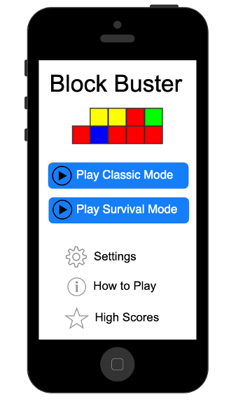

# BlockBuster
Game developed using SwiftUI where the player must try to destroy all blocks form playing area by clicking on groups of blocks with the same color.
BlockBuster has two game modes: Classic and Survival. Classic mode the player has no time limits. In Survival mode, the duration of the round depends on the grade of difficulty selected. In addition, extra blocks fall regularly from the top and could cause an overlow in the playing area stopping the round inmediately. 

  

